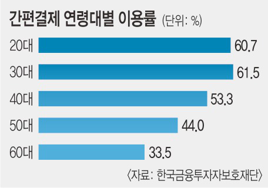
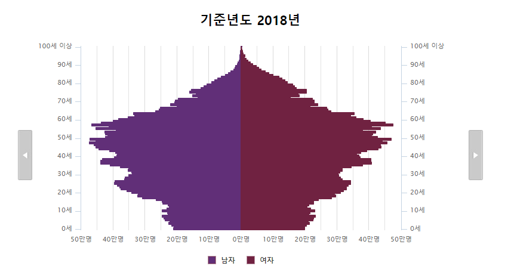
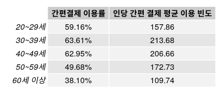
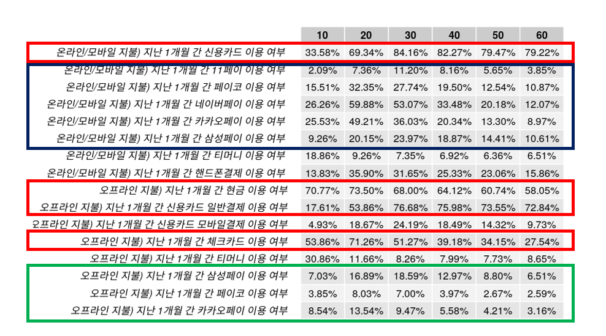
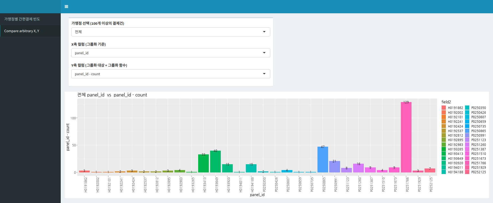
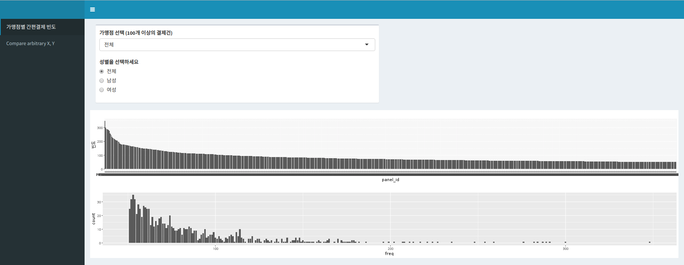
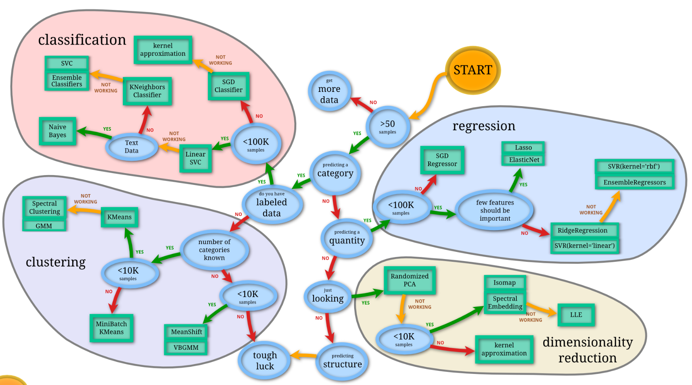
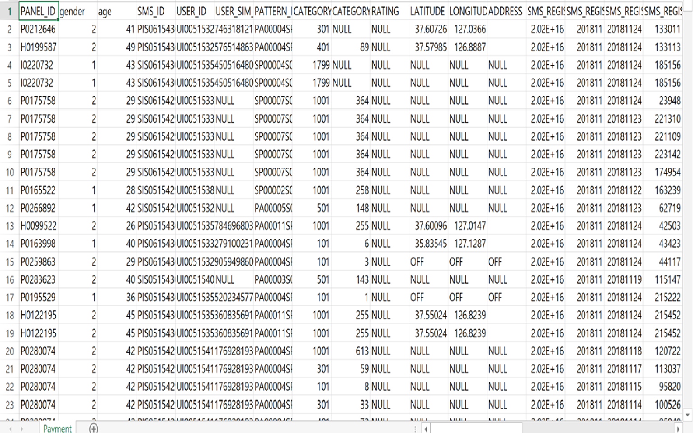

<p align="center" style="margin: 50px 0;">
  
  
</p>
---
# 역할

- 박진식: 데이터 정제 및 변환, application 코드 작성, hosting 서버 설정
- 서아름: 문제정의, 시장자료조사
- 윤정하: 문제정의, 시장자료조사
- 한도윤: 문제정의, 분석방법조사

---
# 조사 주제

### **5060 세대의 간편 결제 이용률 증가를 위한 방안 제안**
---
# 문제 제기
<p align="center" style="margin: 50px 0;">
  
</p>

---
# 문제 제기

- 간편 결제 서비스의 혜택이 주 사용자인 2030 세대에 편중
- 중, 노년층의 소외 현상 심화

--

<p align="center" style="margin: 50px 0;">
  
</p>
---
# 하지만...
---
# 문제 제기
- 5060 세대는
    - 안정적인 경제력을 바탕으로 간편 결제 시장의 ‘큰 손’이 될 가능성이 높은 세대
    - 과거의 베이비붐 세대로서 우리나라에서 차지하는 인구 비율이 높음.

--
<p align="center" style="margin: 50px 0;">
  
</p>
---
# 문제 제기
- 5060 세대는 간편 결제 시장의 블루 오션으로서, 간편 결제 업체들이 반드시 공략해야 할 타겟 소비자층이다!
---
# 문제 제기
- 5060 세대를 효과적으로 공략하기 위해서는 어떻게 해야 할까?
    - ‘경제적 혜택’이 가장 큰 유인
- 5060 세대에 대한 분석을 바탕으로 최적화된 할인혜택, 서비스 등 경제적 유인을 제공
- 5060 세대가 간편 결제 시스템에 익숙해질 수 있도록 이들에게 알맞은 광고, 홍보 방안 제시

---
# 활용 데이터와 분석 도구

--
**엠브레인 패널 데이터를 R을 사용하여 분석한다.**
--

- 간편결제사 정보: 회사이름, 연계 금융사..
- 소비자 기본 정보: 성별, 연령, 거주지역, 결혼상태, 학력, 직업..
- 소비자 설문 정보: 가구, 금융..
- 가맹점 정보: 업종, 브랜드, 위치(위경도), 결제일, 거래금액..
- 패널들의 어플리케이션 이용 정보

---
# 현재까지 진행 상황
--

- 간편 결제 시장 분석
- EDA
- 소프트웨어 제반
---
## 간편 결제 시장 분석

- 2017년 국내 간편 결제 서비스 거래액: **40조원**
    - 2016년(11조7810억원) 보다 3배 이상 성장
    - 특히 온라인 간편 결제 시장의 성장이 두드러짐.

--

- 현재 간편 결제 시장은 **상위 플레이어 4사(삼성페이, 네이버페이, 카카오페이, 페이코)**의 영향력이 매우 큼.
---
## 간편 결제 시장 분석

- 아직까지 국내 지급 결제 시장에서 선호도는 신용카드가 매우 높은 상태
- 우수한 인프라와 범용성, 편리성을 확보한 간편결제 업체들 중심으로 시장이 단순화될 것이라고 예상
    - 경쟁에서 살아남기 위해서는 신용카드보다 뛰어난 편리성, 다양한 혜택 등을 제공하여 소비자를 유치해야 함
---
## 간편 결제 시장 분석

- 각 업체별 특징과 장단점이 뚜렷하게 나타나는 편
--

- 온라인 시장: 네이버페이, 카카오페이가 강세
- 오프라인 시장: 삼성페이가 압도적인 이용률과 가맹점 수를 보유

---
## EDA

<p align="center" style="margin: 40px 0;">
  
</p>
--

- 연령별 간편 결제 이용률 (20대 – 60대, 간편결제를 한 번이라도 이용한 사람의 수 / 한 번도 이용하지 않은 사람의 수)
    - 20-40에 비해 5060의 간편 결제 이용률이 낮음. 

- 연령별 1인당 간편 결제 이용 빈도 (2018.11-2019.02)
    - 5060 세대는 다른 연령층에 비해 간편 결제를 자주 사용하지 않음.

---
## EDA
- 연령별 금융 결제 이용 방식 조사 (중복 응답 허용)
    - **전 연령 모두 현금, 카드 등 기존 결제 방식(붉은색)을 이용하는 경우가 많음.**

<p align="center" style="margin: 20px 0;">
  
</p>
---
## EDA

<p align="center" style="margin: 20px 0;">
  
</p>

- **온라인 간편 결제(파란색)**의 경우 네이버페이, 카카오페이의 이용률이 높은 편임. 그러나 **5060 세대의 경우 5개 결제 회사 모두 10-20%의 낮은 이용률을 보이며, 2030 세대에 비해 특정 간편 결제 회사에 대한 뚜렷한 선호는 드러나지 않음.**
- **오프라인 간편 결제(초록색)**의 경우 전 연령대 모두 전반적으로 이용률이 낮은 편이나, **5060 세대는 더욱 낮은 이용률을 보임.**

---
## EDA

- **실제 데이터에서 5060 세대가 간편 결제를 잘 이용하지 않는다는 사실을 다시 한 번 확인하였음.**
- 아직 활성화에 어려움을 겪고 있는 오프라인 간편 결제 시장 뿐만 아니라 **상대적으로 활성화되어 있는 온라인 간편 결제 시장에서도 5060 세대가 소외되어 있음.**

---
## 소프트웨어 제반
--

- 데이터 정제 및 변환
--

- application 코드 작성
--

- hosting 서버 설정

---
### 데이터 정제 및 변환

- 4개월치 결제 내역
    - 월별로 130만 row 이상

--

- Line by Line
--

- DBMS (DataBase Management System)

---
### application 코드 작성

--

- RMariaDB package
```{r eval=FALSE, tidy=FALSE}
install.packages("RMariaDB")
```

--

- X vs Y plot?
---
### application 코드 작성

--

<p align="center" style="margin: 50px 0;">
  
</p>

--

- SQL `GROUP BY` statement
---
### application 코드 작성

--

<p align="center" style="margin: 50px 0;">
  
</p>
---
### application 코드 작성

- Database Index 적용
---
### hosting 서버 설정

--

- `shinyapps.io`?
--

- 도메인 설정
--

- Database pool 설정
---
# How to Analysis?

상대적으로 많이 저조한 고연령층의 간편결제 이용률을 문제점으로 정의하고, 이들의 이용률을 촉진시키기 위해, 연령별로 간편결제 heavy user와 light user, 미사용자의 특성차이 파악 -> How?

--
<p align="center" style="margin: 50px 0;">
  
</p>

---
# 패널 자료의 모습

<p align="center" style="margin: 50px 0;">
  
</p>


---
# Clustering Criterion

- 클러스터를 구성하기 위한 입력변수는 연령별 간편결제 사용자인 Heavy User와 Light User, 그리고 미사용자인데, 이들을 구분하는 기준으로 <결제금액의 합> 사용

--

- 각 집단의 특성을 비교하기 위한 설명 변수로 자주 이용하는 가맹점의 종류와 위치, 결제 빈도, 자주 이용하는 간편 결제 회사, 자주 이용하는 어플리케이션 종류 등을 설정


---
# 기대 효과

- 고령화 시대의 핵심 고객인 5060 세대를 공략할 수 있는 방안을 제시
    - 5060 세대를 세부 집단으로 분류하여 분석함으로써 보다 정교한 분석과 회사별 타겟팅 전략 도출

--

- 간편 결제 회사는 새로운 타겟 집단을 설정하고, 경쟁적인 간편 결제 시장에서의 활로를 모색할 수 있음

--

- 5060 세대는 간편 결제 서비스를 통한 편리한 금융 생활을 누릴 수 있게 됨
---
class: center, middle
# Thank you